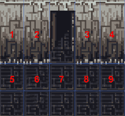

# WHY TILES?

Before diving into coding games, lets talk little about tile based games. Why would you want to use tiles anyway? Are tile based games easier to make or perhaps they are more complex then art based games?

Tiles have been used for making games for a long time. When computers didn't have speeds of GHz and hundreds of MB memory. Slow speed and limited amount of memory forced game makers to use clever ways to make games look better and run faster.

So if you want to put nice background into your game, but the picture would be too large and make game very slow. What to do? Slice the picture into tiles!

In the picture you can see that parts of picture are exactly same. 1 is same as 4, 2 is same with 3 and parts 5-9 are all same thing. If you slice up the picture and reuse same parts in different areas, you have created the tiles. The big picture has much bigger filesize than tiles. You would actually need only 4 different tiles to draw that picture.

Another nice feature about tiles is, when you might want to replace part of your background, then you don't have to redraw everything, you can only replace 1 tile. You can reuse the tiles with different objects too. For example you might have tile with grass and another tile with flower on the grass, then you can take same grass background and only draw the flower.

First, we will see how to store our tile based maps. [Next](./02-map-format)