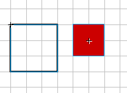

# THE HERO

No game can exist without the hero. The hero will save the world, rescue the love interest and beat up the bad guys. We will add a hero to our game. They wont save the world yet, they wont do anything useful, but they'll be appear on the world.

```
EXAMPLE HERE
```


The hero is red square :) What, he doesnt look mighty? You can draw your own hero. His movie clip is in the library named "char" and its also been set up to be exported as "char". You should not make the hero movie clip larger then tiles.

Also note, how hero movie clip (red square) has registration point centered and tiles movie clip has registration point in the upper left corner:



Want some code? Add the line after tiles definitions:

```
char={xtile:2, ytile:1};
```
This code declares new "char" object. The char object will hold all the information about our character, how he moves, how he feels, what he eats.

This time we will give char object only two properties, xtile and ytile. Those give us the tile our hero stands on. When he moves around, we will update the xtile/ytile properties and we will always know what tile is under the hero. For example, when xtile=2 and ytile=1 (like we wrote), that means hero is standing on the tile "t_1_2". When you look at the example movie, you see that hero stands on the tile 3 positions left and 2 positions down from the upper left corner of our game. All the tiles start counting from 0.

We will add more properties to hero later.

To place hero movie clip on stage, add following lines to the buildMap function after the for loops:

```
game.clip.attachMovie("char", "char", 10000);
char.clip = game.clip.char;
char.x = (char.xtile * game.tileW) + game.tileW / 2;
char.y = (char.ytile * game.tileW) + game.tileW / 2;
char.width = char.clip._width / 2;
char.height = char.clip._height / 2;
char.clip._x = char.x;
char.clip._y = char.y;
```
First line does attach new movie clip from the library in the game.clip (you remember that we saved path to the _root.tiles as game.clip in the last chapter) and give this instance name "char".

Then we save the path to the char movie clip into char object, so every time we want to access the movie clip, we can use simpler char.clip instead of typing this movie clip's full path _root.tiles.char. It also saves us from going through all the code if we might need to move char movie clip to somewhere else.

Next we will calculate two properties in the char object: x and y. You may wonder, what for we need more properties, we already have xtile and ytile. Remember, xtile/ytile count the number of tiles, not actual pixels. The x/y properties will hold the pixel coordinates of our char movie clip. Its good idea to have coordinates in the variables before placing movie clip, you may need to change position because hero has hit the wall or has lost the balance and changing variables is easier then changing _x/_y properties.

We will calculate the actual position of our hero by multiplying the tile number he stand on with size of the tiles and adding half the tile size to place char on the center of tile. So, char.xtile * game.tileW gives us tiles number on horisontal multiplied by width of tile taken from the game object.

Next we save the half the width and height of our hero movie clip into char object. Those will become very useful, when calculating where are the boundaries of hero. Note that you can create your own boundaries, you dont have to use width and height of movie clip. Some heros might have long puffy hair which can collide with walls, then declare your own width and height variables.

Last two lines place the char movie clip char.clip to the coordinates we calculated earlier as x and y.

You can download the source fla with all the code and movie set up here.