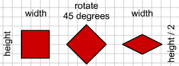
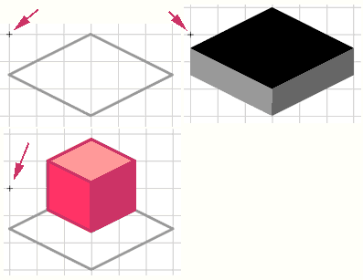
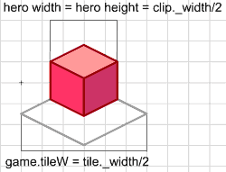

# ISOMETRIC VIEW

Isometric view is great to add depth into your game. Many famous games use this vie, because its simple to do, but looks good. And best thing about isometric view is how easy it is to create based same old tile based approach. Like this:

```
EXAMPLE HERE
```


## THEORY

First you should know, that actual isometric view (from the mathematics) is little more complicated and never used in games. Now that you know it, forget it. From here on, we only talk about simple isometrics. Maybe best way to imagine isometric, is to look, what happens to the normal square, when its transformed into isometric view:



First we rotate the square by 45 degrees and then we make its height half the width. That was simple. Now lets create our tiles and hero:



Its important to place graphics to the registration point (little cross, where Flash starts to count coordinates from) like shown in the picture. The wall tile you can draw as high as you want. For the hero, I have left the tile in the picture so you hopefully understand its position better, dont place that rectangle in the final graphics of hero. It would only look strange, if hero walks around, rectangle around him.


## CHANGES TO THE CODE

First thing to change, is size of tiles and size of hero. But wait, what size? So far it was clear, width and height of movie clip, but in isometric view the height of movie clip can be almost anything.



So, value of tileW variable is half the width of actual tile graphics. For the hero, its width and height properties are equal and half of its graphics actual width. Write it down:

```
game = {tileW:30};
char = {xtile:2, ytile:1, speed:4, width:16, height:16};
```

Biggest change in the code will be actual placement of movie clips on screen. In normal view, we used clip._x=x and clip._y=y, to make same x/y appear in isometric view, we will use:

```
clip._x = x - y;
clip._y = (x + y) / 2;
```

In the buildMap function change placement of tiles:

```
clip[name]._x = (j - i) * game.tileW;
clip[name]._y = (j + i) * game.tileW / 2;
```

Tiles depth is calculated same way as before, but we wont use x/y, we will use tiles new coordinates in isometric view:

```
game[name].depth = (j + i) * game.tileW / 2 * 300 + (j - i) * game.tileW + 1;
```

And same thing for the hero:

```
var ob = char;
ob.x = ob.xtile * game.tileW;
ob.y = ob.ytile * game.tileW;
ob.xiso = ob.x - ob.y;
ob.yiso = (ob.x + ob.y) / 2;
ob.depthshift = (game.tileW - ob.height) / 2;
ob.depth = (ob.yiso - ob.depthshift) * 300 + ob.xiso + 1;
game.clip.attachMovie("char", "char", ob.depth);
ob.clip = game.clip.char;
ob.clip._x = ob.xiso;
ob.clip._y = ob.yiso;
```

As you can see, new properties xiso and yiso will hold the coordinates of char in the isometri view, but we still have properties x/y. Variable depthshift is needed since our char is not drawn on the center of the tile (look the picture with char), it is shifted up.

**All the collision and movements are calculated in normal way, but in the end position of movie clip is converted into isometric view**. In the end of moveChar function change the char placement same way:

```
ob.xiso = ob.x - ob.y;
ob.yiso = (ob.x + ob.y) / 2;
ob.clip._x = ob.xiso;
ob.clip._y = ob.yiso;
ob.clip.gotoAndStop(dirx + diry * 2 + 3);
ob.xtile = Math.floor(ob.x / game.tileW);
ob.ytile = Math.floor(ob.y / game.tileW);
ob.depth = (ob.yiso - ob.depthshift) * 300 + (ob.xiso) + 1;
ob.clip.swapDepths(ob.depth);
```

After we have moved the char, detected the collisions with walls and probably placed char near the wall, properties x and y will hold correct position in non-isometric view. Now we only calculate new values for isometric view.

You can download the source fla with all the code and movie set up here.

