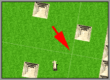

# ROTATE THE THE BACKGROUND

In the last chapter our hero gained the ability to rotate and walk in any angle. While the hero is surely very thankful for it (and lets be honest, who wouldn't) we can make more interesting by scrolling and rotating the background. The hero will stay in place, but the background is rotated with left/right arrow keys and like rotatable background isnt enough to make human race happier, the background will also scroll with up/down arrow keys.

```
EXAMPLE HERE
```

If you look at the fla in Flash preview, you see how whole map is actually drawn out, but only small portion is visible at any time. So be careful when experimenting with huge maps with big visible area, your game may be too slow to play. Don't forget that each tile Flash has to draw/move/rotate needs another cycle from poor old CPU and most people playing your game don't yet have latest 10GHz super-computers (no, I haven't actually asked most people in the world what kind of computers they use, but I still believe they don't have latest computers. I could be wrong of course).

First we need to rotate the tiles. We do have "tiles" movie clip with all the tiles already and you might think we can simply rotate the "tiles" mc. Thats wrong! World is so unfair sometimes... The problem is, that all movie clips in the Flash are rotated around their center point. Our tiles movie clip has center point in the upper left corner and so it would be rotated around top left corner. Unless you want the game, which always rotates around left top corner (I havent seen such game so far), we need to add another holder movie clip. We will place "tiles" mc inside this holder mc and then we can rotate the holder mc without worrying about the left top corner anymore.

In the start of builMap function add code:

```
_root.attachMovie("empty", "rotate_tiles", 1);
_root.rotate_tiles._x = 120;
_root.rotate_tiles._y = 140;
_root.rotate_tiles.attachMovie("empty", "tiles", 1);
game.clip = _root.rotate_tiles.tiles;
```

The "rotate_tiles" is the movie clip, that will be rotated. It won't move around, so place it in the center of your stage horisontally. I have also placed near the bottom of the stage, so the hero will have more visible area in front of him and less behind. Thats up to you how you want to position the rotated tiles, fortunately you can change its position around as much as you want.

Because we will have scrolling background, our hero will stay in same spot, but the background (game.clip mc) is moved in opposite direction. So we have to place it in the beginning to. Add to buildMap function:

```
game.clip._x = -(char.xtile * game.tileW) - game.tileW / 2;
game.clip._y = -(char.ytile * game.tileH) - game.tileH / 2;
```

The (char.xtile*game.tileW)-game.tileW/2 is where the hero will be placed and tiles mc is moved by same amount to the completely other way.

We also need to add 2 lines in the very end of moveChar function to scroll the background after we have calculated the new position for the hero:

```
game.clip._x = game.centerx - ob.x;
game.clip._y = game.centery - ob.y;
```

Now for the actual rotation of the tiles, we simply add 1 line to rotate the added holder movie clip in other way. As we have declared game.clip inside this holder mc, we can use _parent property to access it:

```
if (Key.isDown(Key.RIGHT))
{
  game.clip._parent._rotation -= 5;
  ob.clip._rotation += 5;
}
else if (Key.isDown(Key.LEFT))
{
  game.clip._parent._rotation += 5;
  ob.clip._rotation -= 5;
}
```

And thats it for today.

Tip: when rotated, your tiles might create some ugly-looking lines between them:



You can fix it with increasing the size of your tiles by 1 px. In our example the tiles would still be placed using 30px space, but their actual size would be 31px.


You can download the source fla with all the code and movie set up here.