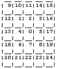

# PATHFINDING

One thing common so far with all our examples is how the hero is dumb. If you tell him to move left, he would go left. Surely being dumb is nice when you are in the army, but our hero should have some sort of brains to find its way through the dangers of the world. So, lets put in some pathfinding.

Before we do, perhaps it would be good idea to say out loud and clear, what is pathfinding. Pathfinding is finding the path from tile A to the tile B. Phew, that went well. And didn't take days.


```
EXAMPLE HERE
```

## MANY PATHS

Pathfinding is actually very complex thing. But its also very useful thing. We can use same system not only for the hero, but for every other object in the game too. Imagine the game with many enemies, they all want to find path to our hero and eventually kill the hero (they wouldn't be enemies, if they wouldn't want to kill the hero).

In this example we expect the hero to find path from the tile he currently stands on, to the path where the mouse was clicked. Don't be fooled to mix up any path with shortest path. Any path can be found even when we wonder around the map randomly (like our enemies did in the chapter 9). It might take time, but eventually the path from tile A to the tile B is found. Now the shortest path means we find path that takes less steps then any other path. Humans do that all the time, if you go home from work, you will find shortest path between work and home and use it. Unless you wish to visit the pub in your way home.

In some case tile might not be equal in number of steps they take to walk over them. Like you could have road and swamp and forest tiles and surely walking on the road tile takes less time then walking on the swamp. I wont go into this kind of situation too deep, but you will need an A* (A star) algorithm to find paths in such maps. Several A* codes for Flash are freely available in the internet, just search for them.

Pathfinding can take very long time. Specially on the bigger maps, with lots of tiles to search through, it can take several seconds to find the path. As you know, Flash is not extremely powerful and if your game stops every now and then to find paths, its not playable anymore. Before you add pathfinding to your game, think. Do you really need it? Can you make it faster? Can you cheat to create not-so-perfect-but-still-nice-paths?


## BREADTH-FIRST

The pseudo code for the breath-first search is very clearly explained in this link and please read the great article here. My example follows the pseudo code.

I will quote from the page above (skip it if you did read the explanation from the link):
"This is a very expensive, but relatively clear algorithm. It begins with a starting point Source, and finds a path to a goal Target. The basic approach is to take each neighbour of the starting point, and then take each neighbour of those neighbors, and then the neighbours of those neighbours, and so on, expanding the tiles (nodes) being considered until finally one of them is the Goal. Each time a node is looked at, its neighbours are pushed onto a queue; thus the order in which the nodes are considered is one neighbour after another. Where numbers indicate the order in which the nodes are considered, the pattern is:



That is, we begin with 0. All of its neighbours 1-8 are put on the queue. Then the first element (1) is taken off the queue, and its neighbours 9-13 are put on the queue. The next element (2) is then taken off the queue, and its neighbours (i.e. 14) are put on the queue. Then (3) is taken off the queue, and its neighbours 15-17 are put on the queue; (4) is taken off, and its neighbours 18 are put on; and so on."


## CODING BREATH-FIRST

We will use the example from the chapter 17 as the base. Build the map same way as before, using buildMap function. No changes needed in the work function either. First new thing will be in the getTarget function. After we have made sure walkable tile was clicked, we update the target tile and call new findPath function:

```
function getTarget()
{
  if(game["t_" + game.ymouse + "_" + game.xmouse].walkable)
  {
    game.targetx = game.xmouse;
    game.targety = game.ymouse;
    if(!char.moving)
    {
      findPath(char.xtile, char.ytile, game.targetx, game.targety);
    }
    else
    {
      game.clicked=true;
    }
  }
}
```

We are checking if the hero is currently moving from one tile to another. Thats because we will let the player click any time on the stage, even when hero is currently moving from one tile to another, but hero will first finish its current movement and reach the center of the tile. When on the center, we will check for game.clicked and call findPath function if user has clicked.

As you might have guessed by now, the findPath function is going to do main work in the finding path.

```
function findPath(startx, starty, targetx, targety)
{
  path = {};
  path.Unchecked_Neighbours = [];
  path.done = false;
  path.name = "node_" + starty + "_" + startx;
  path[path.name] = {x:startx, y:starty, visited:true, parentx:null, parenty:null};
  path.Unchecked_Neighbours[path.Unchecked_Neighbours.length] = path[path.name];
  while(path.Unchecked_Neighbours.length > 0)
  {
    var N = path.Unchecked_Neighbours.shift();
    if (N.x == targetx and N.y == targety)
    {
      make_path(N);
      path.done = true;
      break;
    }
    else
    {
      N.visited=true;
      addNode (N, N.x+1, N.y);
      addNode (N, N.x-1, N.y);
      addNode (N, N.x, N.y+1);
      addNode (N, N.x, N.y-1);
    }
  }
  delete path;
  if (path.done)
  {
    return true;
  }
  else
  {
    return false;
  }
}
```

Lets see what's going on here. The function will receive 4 variables: x and y coordinates of both start and target tiles. Then we create new "path" object and Unchecked_Neighbours array. "path" object is our temprorary object to hold every kind of bits and pieces while we search for the path. In the end of pathfinding we delete "path" object and leave everything clear again.

"done" property is used in the end to check if we have actually found the path (done is true) or has player been foolishly clicking on some tile, which no path is reaching (done is false).

Then we create our first node on the start position and add it to the Unchecked_Neighbours array. Each node object will have several important properties. node.x will hold its x position and node.y its y position. node.visited will be true, when the node has been already processed, this way we dont go back to the tiles we already searched. node.parentx and parenty will refer to the node, where we reached on the current node. If for example we stepped on the tile 1_2 from the tile 1_3, then its parentx will be 1 and parenty will be 3. Its important to remember the parent node, since that will allow us to actually build the path array later, when we have found the path.

Now we start the main while loop, which will continue until Unchecked_Neighbours array is empty. We then take first element from the Unchecked_Neighbours array (shift command) and check if that node is the target. If it is the target, we have found the path and will call function make_path, set "done" property to true and break the loop.

If unfortunately it wasn't the target, then we have to continue looking. We set node's "visited" property to true and add all its neighbours using addNode function.

```
function addNode (ob, x, y)
{
  path.name = "node_" + y + "_" + x;
  if(game["t_" + y + "_" + x].walkable)
  {
    if (path[path.name].visited != true)
    {
      path[path.name]={x:x, y:y, visited:false, parentx:ob.x, parenty:ob.y};
      path.Unchecked_Neighbours[path.Unchecked_Neighbours.length] = path[path.name];
    }
  }
}
```

The addNode function gets "ob" as the current node and x/y for the new node we are about to add. We only create new node if that tile is walkable and is not visited yet. New node will then get its parentx and parenty properties from the ob node.

To finish up our path, we have to actually create path array for our hero to use. Don't confuse this path array with the path object used in the findPath function. And if you wish to find many paths for several moving objects, it would be better to attach path array into each object and not into game object as we have done it here:

```
function make_path(ob)
{
  game.path = [];
  while (ob.parentx != null)
  {
    game.path[game.path.length] = ob.x;
    game.path[game.path.length] = ob.y;
    ob = path["node_" + ob.parenty + "_" + ob.parentx];
  }
  char.moving = true;
}
```

The while loop will continue until node's parentx is null, meaning it is the original starting node, where hero currently stands. We add each node's x and y position to the path array and then make its parent the current node. In the end we set char to move again. SInce we add both x and y position separately, the path array will be holding information in some kind of this format:

[targetx, targety, many steps here, firststepx, firststepy]
We also have to use the path array in the moveChar function. After we calculate the tile where chars center is (values for xtile and ytile), change the code:

```
if(game.clicked)
{
  game.clicked = false;
  findPath(char.xtile, char.ytile, game.targetx, game.targety);
  return;
}
if(game.path.length > 0)
{
  game.targety = game.path.pop();
  game.targetx = game.path.pop();
  if(game.targetx > ob.xtile)
  {
    ob.dirx = 1;
    ob.diry = 0;
  }
  else if(game.targetx < ob.xtile)
  {
    ob.dirx = -1;
    ob.diry = 0;
  }
  else if(game.targety > ob.ytile)
  {
    ob.dirx = 0;
    ob.diry = 1;
  }
  else
  {
    ob.dirx = 0;
    ob.diry = -1;
  }
}
else
{
  ob.moving = false;
  return;
}
```

Here we check if the player has clicked on some tile while we were busy moving from one tile to another. If the player really has clicked (the players are like this, they click all the time), we call findPath function and return.

But if player hasn't clicked we check if we have some path left to continue moving. So, if path array contains some elements, we remove LAST element from the array using pop command and assign it to the targety. Please pay attention here, last element goes to y and then we take last element again and assign it to targetx. Now we compare current position of the hero with next tile he should step on and change dirx/diry to make hero move correctly.

Please do consider that this search is extremely slow. It might even crash the Flash player if you use it on the large maps. You might want to add some timer into findPath loop to break it when enough steps has been passed, but no path has been found yet. In large maps it might also be good idea to use waypoints with precalculated paths to spend less time on the search for the path.

You can download the source fla with all the code and movie set up here.

