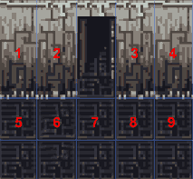

# WHY TILES?

Before diving into coding the game, lets talk little about the tile based games. Why would you want to use tiles anyway? Are tile based games easier to make or perhaps they are more complex then art based games? Is Flash good for tile based games?

Tiles were already used long-long time ago for making games. It was the time, when computers didnt have speeds of GHz and hundreds of MB memory. Slow speed and limited amount of memory meant game makers had to use their brains and create clever ways to make games look better and run faster.

So, you want to put nice background into your game, but the picture would be too large and make game very slow. What to do? Slice the picture into tiles!

In the picture you can see that parts of picture are exactly same. 1 is same as 4, 2 is same with 3 and parts 5-9 are all same thing. If you slice up the picture and reuse same parts in different areas, you have created the tiles. The big picture has much bigger filesize then tiles. You would actually need only 4 different tiles to draw that picture.

Other nice feature about tiles is, when you might want to replace part of your background, then you don't have to redraw everything, you can only replace 1 tile. You can reuse the tiles with different objects too. For example you might have tile with grass and another tile with flower on the grass, then you can take same grass background and only draw the flower.

  
## FLASH AND TILES

As we all know Flash is vector based, so Flash files have small size and you can resize them. So, you wont need tiles at all to create game? Well, you can easily do art based games in Flash, but when your game area gets bigger and you want more features, you might be in trouble. Some things are so much easier to do in tile based games (isometric view, pathfinding and depth sorting to name few). Dont forget, tile based games have been around for a long time and much of the theory is usable with Flash too.

Sad part about tile based games in Flash is, that we wont benefit much from the drawing or timeline parts, our game is made with actionscript and basically we just have bunch of code to create, move and modify images on the stage.

Its also good idea to use bitmap images as tiles graphics. Yes, we could draw everything inside Flash and have the vector graphics, but when the game is run, player has to calculate the vectors on screen and we dont want anything to slow down our game. Bitmaps are pre-rendered and usually they look better too. If you want to import bitmap tiles into Flash, its usually best to save the images as GIF files with transparent background (for objects).

Enough boring talk, lets make something :)

First, we will see how to store our tile based maps.