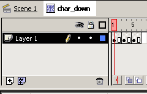
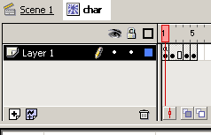
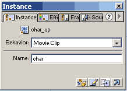

# KEYS TO MOVE

In this chapter we are going to move our hero using arrow keys in 4 direction. He will face in the direction of movement and show walking animation while moving. Animation is stopped when standing still. Try it here:

```
EXAMPLE HERE
```


There is not collision detection, so hero can walk outside from stage, but dont worry about that, we will fix it in next chapter.

First lets set up our hero character. Create 3 new movie clips. You will need one movie clip for character moving left (or right, I chose left), 1 movie clip for character moving up, and final movie clip for moving down. Inside those movie clips place the animations of your character moving.



There is no code needed for those movie clips.

Now edit your "char" movie clip and create total of 5 keyframes inside it:



In keyframe 1 place the "char_up" movie clip, in keyframe 2 place "char_left", keyframe 4 gets "char_right" and keyframe 5 "char_down". You can use same movie clip for both left and right movement, you only flip one of the instances horisontally. Now make sure every instance with movement animation has instance name "char". Check the frames 1, 2, 4 and 5 again. They all are named "char"? Dont worry, if you dont understand yet why certain movement is suppose to be in certain frame, we explain it when we look at the movement code.



Ok, time to script the actions.


## CODING

Our hero will move and movement needs speed, so add speed property to hero object:

```
char = {xtile:2, ytile:1, speed:4};
```
Speed is the number of pixels our hero will move on the screen, higher speed means he moves faster and slower speed makes him move like a snail. Its good practise to use integer as speed or you might get weird results and you wont see any difference between 10 pixels and 10,056873 pixels anyway.

As you remember (if you dont remember, please look in the previous chapter), we have created object _root.char to hold char info, and we have placed "char" movie clip in the "tiles" movie clip. To make our hero wake up and start to move, we need two more functions and controller movie clip to check for keys in each step.

Drag instance of "empty" movie clip to the stage. You can place it outside of visible area. Its only going to call the function so it doesnt matter where it stands. Write code to this mc:

```
onClipEvent (enterFrame)
{
	_root.detectKeys();
}
```
You can see that in every frame we are calling function detectKeys. Now lets write it:

```
function detectKeys()
{
	var ob = _root.char;
	var keyPressed = false;
	if (Key.isDown(Key.RIGHT))
	{
		keyPressed = _root.moveChar(ob, 1, 0);
	}
	else if (Key.isDown(Key.LEFT))
	{
		keyPressed = _root.moveChar(ob, -1, 0);
	}
	else if (Key.isDown(Key.UP))
	{
		keyPressed = _root.moveChar(ob, 0, -1);
	}
	else if (Key.isDown(Key.DOWN))
	{
		keyPressed = _root.moveChar(ob, 0, 1);
	}
	if (!keyPressed)
	{
		ob.clip.char.gotoAndStop(1);
	}
	else
	{
		ob.clip.char.play();
	}
}
```
First we declare two variables. We set variable ob to point to _root.char (remember, thats where we hold all the info about hero) and we set variable keyPressed to false. Variable keyPressed we use to check if in the end of the function some arrow keys have been pressed or not.

Next we have 4 similar if statements. Each of them checks if one of arrow keys is pressed down. If key is down, they call another function moveChar, using lines like:

```
keyPressed = _root.moveChar(ob, 1, 0);`
```
This line calls the function moveChar using 3 arguments. First argument is the variable ob, that points to our char object. Last two arguments are always set -1, 1 or 0. Those determine if we should move hero horisontally by changing its x coordinate (second argument) or vertically by changing y coordinate (third argument). Last we set the return value of function moveChar to the variable keyPressed. You can soon see that moveChar function always returns "true", so if any of the arrow keys are pressed, variable keyPressed will be set to true.

Last piece of code checks, if variable keyPressed is false, meaning no arrow keys has been pressed, in which case we stop the movement animation using gotoAndStop(1). If variable keyPressed is however true, we continue to play the movement animation.

Now the second function:

```
function moveChar(ob, dirx, diry)
{
	ob.x += dirx * ob.speed;
	ob.y += diry * ob.speed;
	ob.clip.gotoAndStop(dirx + diry * 2 + 3);
	ob.clip._x = ob.x;
	ob.clip._y = ob.y;
	return (true);
}
```
See, moveChar function accepts 3 arguments, variable ob will be the object to move, dirx and diry are values to move in x or y direction. This is very universal function, we can use it to move everything on the game. If we had bullet flying, we could call moveChar with bullets direction, if we had enemy walking, we can again use same function to move it.

Next two lines adds value of ob.speed to objects x or y variable. Again, if we had different objects (bullet, enemy), they can each have their own speeds. So, when we detected right arrow key and called the moveChar function using 1, 0 then dirx=1 and diry =0. Now the x will be increased by speed while y remains the same. If we called moveChar function using 0, -1 (thats what up arrow uses), the y would be decreased by speed and x remains same.

Note that if we would have more movement stuff, like collision or gravity, we would calculate the values of x and y right here, before even replacing the actual movie clips. Thats much better way then using simple mc.hitTest method.

The line

```
ob.clip.gotoAndStop(dirx + diry * 2 + 3);
```
sends character movie clip to correct frame to face to the direction it moves. You can calculate all the variations of dirx/diry (there are 4 different pairs so it wont take long to check) and you see that character movie clip is sent to right frame just like we did set it up earlier.

Dont have calculator? Lets see if it works: right arrow key was pressed, dirx = 1, diry = 0. Find the frame. diry * 2 = 0. dirx + 0 + 3 = 1 + 3 = 4. Its going to show frame 4. And frame 4 is where we did put our char_right animation.

Next two lines set the _x/_y properties of character movie clip to the values of x/y variables.

And finally we return "true" so we get the variable keyPressed to have correct value.

Collision with walls follows in the next chapter. Thats fun :)

You can download the source fla with all the code and movie set up here.