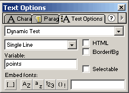

# GETTING ITEMS

In this chapter we will look how to make our hero to pick up some items from the ground. You know the stuff: crystals, coins, dead spiders, healing potions, ammunition:

```
EXAMPLE HERE
```

Items are different in what they actually do. Some items increase your score, some increase your health or give you more bullets. In this example all items do only one thing - they give you more points. Its up to you to create other kind of items.

We will start with the movie from page 9 Open the door so we don't have too much code to make things hard to understand.

First draw your items movie clip. Place graphics of different items in the frames inside it. Like hero and enemies, all items should be aligned in the center. In the first frame add "Stop" action to prevent mc from playing all the lovely graphics. Make sure this mc linkage is set to "Export this symbol" and its identifier is "items". Having items in the separate movie clip allows us to place same item on any background tile without the need to draw tiles again.


## WHAT'S YOUR POINT?

To show the collected points draw dynamic text box on the screen. Position this text box outside from tiles area so tiles wont cover it. The dynamic text box should show variable "points":



The variable "points" will need to remember the current points even when we change maps. We can safely attach it to the game object. In declaring game object add property points and set it to 0 (most games start with 0 points).

```
game = {tileW:30, tileH:30, currentMap:1, points:0};
```

## SOMETHING TO PICK UP

Like with everything else, first we will declare the items objects and create array to hold positions of items in different maps:

```
myItems = [
[0],
[[1,1,1],[1,1,2],[2,1,3]],
[[2,1,3],[2,6,3],[1,5,4]]
];


game.Item1 = function () {};
game.Item1.prototype.points = 1;


game.Item2 = function () {};
game.Item2.prototype.points = 10;
```

myItems array is built same way as enemies array (page 13 ). It has array for each of the maps. We havent used map0 so first array is empty. For map1 we have set 3 items: [1,1,1],[1,1,2],[2,1,3]. Each item has 3 numbers, first number is the type of item (1 or 2 here) and it is also the number of frame to be shown in the attached items movie clip. Second and third number determine tile it will be placed. Lets look at the last item: we know it is type 2 and it will be placed on the tile x=1, y=3.

Last part of code declares two types of items. Currently they only have one property "points". Thats how much points player gets for picking the item. Type1 item will add 1 to the players score, type2 item gives whopping 10 points.

Now lets modify the buildMap function to add items when map is created. Add this code before char creation:

```
game.items = myItems[game.currentMap];
for (var i = 0; i < game.items.length; ++i)
{
	var name = "item" + game.items[i][2] + "_" + game.items[i][1];
	game[name] = new game["Item" + game.items[i][0]];
	game[name].position = i;
	game.clip.attachMovie("items", name, 10001 + i);
	game[name].clip = game.clip[name];
	game[name].clip._x = (game.items[i][1] * game.tileW) + game.tileW / 2;
	game[name].clip._y = (game.items[i][2] * game.tileH) + game.tileH / 2;
	game[name].clip.gotoAndStop(game.items[i][0]);
}
_root.points=game.points;
```

First we make copy of the myItems array for the current map. This array called "game.items" will hold the information about items on the current map. We then loop through all the elements in the items array.

From the line:

```
var name = "item" + game.items[i][2] + "_" + game.items[i][1];
```

we will get name for new item. Its name will follow the same rules as names of our tiles, item on the tile x=1, y=3 will be named "item3_1".

After creating new item object from the templates we made earlier, we save position into that new object. What position is that? Its counter "i" and by saving it in the item object we will know which item in the items array this object represents. This will be very handy when we start to pick up items. Lets see: when we make map1 and i=1, we are creating item from the data [1,1,2], thats second element for the map1 items array. Item will be named "item2_1" and we can access its position in the array with item2_1.position. More about this when we remove items.

After that we place new instance of items movie clip on stage and place it in the correct coordinates. Last line in the loop sends new movie clip to the frame equal with the type of item. All type1 items will show frame 1 for example.

Finally we update the points variable to show correct number of points player has. In the beginning of the game he probably has 0 points, but when changing maps we still use same function and by that time player might have been lucky and collected some points.


## FIND IT

We have items, we have hero, now we have to make sure hero knows when he has stepped on something. Add to the end of moveChar function following code:

```
var itemname = game["item" + ob.ytile + "_" + ob.xtile];
if (itemname and ob == _root.char)
{
	game.points = game.points + itemname.points;
	_root.points = game.points;
	removeMovieClip(itemname.clip);
	game.items[itemname.position] = 0;
	delete game["item" + ob.ytile + "_" + ob.xtile];
}
```

The variable itemname will have value based on the current position of hero. When hero stands on the tile x=4, y=9, it will look for "item9_4". If such object exists, itemname will refer to that object, but in the unlucky case of not having item in that tile, itemname will have no value.

If we have found item object and we are moving hero, we will first add points from the item object to the game.points and then update variable _root.points too to show them.

Now its time to remove item from the stage. Each item has to be removed from 3 places: its movie clip, from items array and its object. Currently we dont delete it from the items array, we just set 0 in the position of this item. And dont forget, items array is only copy of myItems array, if we leave the map and return, all items would appear again. For prevent such bad idea, we will update the changeMap function.

Add to the beginning of changeMap function:

```
var tempitems = [];
for (var i = 0; i < game.items.length; ++i)
{
	if(game.items[i])
	{
		var name = "item" + game.items[i][2] + "_" + game.items[i][1];
		delete game[name];
		tempitems.push(game.items[i]);
	}
}
myItems[game.currentMap] = tempitems;
```

Here we use temporary array "tempitems" to copy items not yet picked up back from items array to the myItems array. When element in the position i is not 0, that means item was not picked up and we will save it to be shown next time player enters this map. But to make sure the item object wont appear in next map, we have to delete it first. However when item was picked up, it will not appear again when players comes back.

You can download the source fla with all the code and movie set up here.

 

And here I have set up side scroller with everything talked so far:

```
EXAMPLE HERE
```

Download the source fla for side scroller with all the code and movie set up here.

  