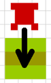
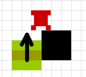
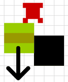
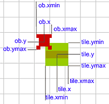

# MOVING TILES

Gather up, boys and girls, for today I am going to tell you a little story about moving tiles. Some of you may know it already by the name "moving platform", dont be fooled by the name, its still same cute thing.

Once, long time ago, in the land of tile based games, lived a young tile. He was a happy tile. One fine day a hero came to him and asked: "Young tile, why dont you move?"

"I dont know how to move," said little tile.

"Thats sad," sighed the hero, "since I would love to stand on you and move with you to the places I cant reach by my own."

That day young tile realised his life was not so happy anymore.

But we can help him to move:

```
EXAMPLE HERE
```

Before we actually start the coding, we have to make some rules. Rules, while annoying, are very helpful. What are we doing? Where to go? Whats the meaning of life? Rules to answer:

- moving tiles are cloud type (for explanation please look here)
- moving tiles can move horisontally and vertically
- hero can land on the moving tile only from above
- when hero is standing on moving tile, he moves with the tile
- hero on moving tile still cant go into wall

## STEPPING ON MOVING TILE

So, how can hero land on the moving tile. First and simplest way is to jump.



On the picture hero is moving down and in the next step he would be inside the moving tile. We will place him standing on the tile. Note that hero MUST be above the moving tile and hero MUST be moving down. In any other case hero wont land on moving tile.

But thats not the only way for hero to get on the moving tile. In the next picture hero is standing still on the piece of wall and he is not moving anywhere.



But the moving tile is moving up and in the next step, hero would be inside the moving tile. Yes, we again have to make sure the hero will be catched by the moving tile and he starts to move up with the moving tile.


## STEPPING OFF

Once we have the hero standing on the moving tile, we also need to create some ways for the hero to get off. First, he can jump off. He can walk over the edge of moving tile. And also couple of possible situations exist in the next pictures:


When hero stands on the moving tile moving up and in the next step hero would hit the wall above, he should drop off the moving tile or he would be squashed. When hero is standing on the moving tile moving horisontally, hitting the wall left/right in next step, he should be placed near the wall and in case the moving tile keeps moving, hero should fall off.



In this picture hero is moving down while standing on the moving tile. When the hero hits the wall tile, he should stay on the wall. Moving tile continues going down, but without the hero.


## PREPARING

Draw moving tile movie clip. You can have many different moving tiles, put them in different frames inside "movingtiles" mc. Make sure mc in the library is linked as "movingtiles".

Declare movingtiles objects:

```
game.MovingTilep1 = function () {};
game.MovingTilep1.prototype.speed = 2;
game.MovingTilep1.prototype.dirx = 0;
game.MovingTilep1.prototype.diry = 1;
game.MovingTilep1.prototype.miny = 0;
game.MovingTilep1.prototype.maxy = 2;
game.MovingTilep1.prototype.width = game.tileW / 2;
game.MovingTilep1.prototype.height = game.tileH / 2;
 
game.MovingTilep2= function () {};
game.MovingTilep2.prototype.speed = 2;
game.MovingTilep2.prototype.dirx = 1;
game.MovingTilep2.prototype.diry = 0;
game.MovingTilep2.prototype.minx = -2;
game.MovingTilep2.prototype.maxx = 2;
game.MovingTilep2.prototype.width = game.tileW / 2;
game.MovingTilep2.prototype.height = game.tileH / 2;
```

We have 2 kinds of moving tiles: MovingTilep1 will be moving vertically (its diry property is set to non-zero value) and MovingTilep2 is horisontal mover (since its dirx is set so). The speed property, as you might of already guessed, sets how many pixels tile moves in each step.

The miny/maxy/minx/maxx properties will set the boundaries for the movement. We could write some absolute values too, but then doing changes will be confusing. Instead, we have the boundaries set as relative to the starting position of the moving tile. We can place the moving tile in any position and it will still move correctly between its boundaries. Remember, moving tiles dont check for any wall tiles and its your job to place them so they dont move through walls. Or place them so they move through walls if you want so. You are making the game, so you are the god.

Lets look at the example. Movingtile starts in the position x=2, y=5. It has vertical movement and miny=-1, maxy=4. How far will it move then? Starting y-miny=5+(-1)=4, so minimum position it goes, is x=2, y=4. Maximum position is 5+4=9 or the postion x=2, y=9.

To give moving tiles starting position, we use array similar to the enemies array:

```
//moving tiles array is in the order [tile type, xtile, ytile]
myMovingTiles = [
[0],
[[1, 4, 2]],
[[2, 4, 4]]
];
```

In the map1 we have declared 1 moving tile. Its type 1 (made from the template MovingTile1) and its placed at the starting position x=4, y=2. Map2 also has only 1 moving tile. You can put more then 1 moving tile in each map.

Next we need to add moving tiles in the buildMap function. Write after the enemies code:

```
game.movingtiles = myMovingTiles[game.currentMap];
for (var i = 0; i < game.movingtiles.length; ++i)
{
	var name = "movingtile" + i;
	game[name] = new game["MovingTilep" + game.movingtiles[i][0]];
	game.clip.attachMovie("movingtiles", name, 12001 + i);
	game[name].clip = game.clip[name];
	game[name].clip.gotoAndStop(game.movingtiles[i][0]);
	game[name].xtile = game.movingtiles[i][1];
	game[name].ytile = game.movingtiles[i][2];
	game[name].x = game[name].xtile * game.tileW + game.tileW / 2;
	game[name].y = game[name].ytile * game.tileH + game.tileH / 2;
	game[name].clip._x = game[name].x;
	game[name].clip._y = game[name].y;
	game[name].minx = game[name].minx + game[name].xtile;
	game[name].maxx = game[name].maxx + game[name].xtile;
	game[name].miny = game[name].miny + game[name].ytile;
	game[name].maxy = game[name].maxy + game[name].ytile;
}
```

We take the array for current map from the moving tiles array. Variable game.movingtiles will be holding info about how many moving tiles we have on stage and where they start at. Then we create new object, place mc on stage in correct position and send it in correct frame. Note that type1 moving tile will be sent to the frame1, type2 to the frame2. Last part of the code calculates values for the boundaries for each moving tile. While the names are again miny/max/minx/maxx, the properties are not relative anymore. Each moving tile object will have absolute values for its boundaries so we dont have to contsantly calculate them over and over to check if its time to turn back.

In the moveChar function we have to add 1 line in the beginning to save current y position:

```
ob.lasty = ob.y;
```

We will also have to rewrite the code in the moveChar function for movement down

```
if (diry == 1)
{
	if (ob.downleft and ob.downright and !checkMovingTiles(speed * diry))
	{
		ob.y += speed * diry;
	}
	else
	{
		ob.jump = false;
		if(ob.onMovingTile)
		{
			ob.y = ob.onMovingTile.y - ob.onMovingTile.height - ob.height;
		}
		else
		{
			ob.y = (ob.ytile + 1) * game.tileH - ob.height;
		}
	}
}
```

We have added the call for checkMovingTiles function, which will return true in case hero will land on moving tile. And if we have landed on it, we set the y coordinate of the hero so it stands just above the tile.


## IS HERO ON MOVING TILE?

You already guessed from the addition in the moveChar function, yes, its time to make new function for the checking if char is standing on the moving tile. checkMovingTiles function not only finds the answer, but it also saves the name of the tile hero currently moves on, into the char object.

```
function checkMovingTiles (y)
{
	if(char.diry <> -1)
	{
		var heroymax = char.y + char.height + y;
		var heroxmax = char.x + char.width;
		var heroxmin = char.x - char.width;
		foundit = false;
		for (var i = 0; i < game.movingtiles.length; i++)
		{
			var ob = game["movingtile" + i];
			var tileymax = ob.y + ob.height;
			var tileymin = ob.y - ob.height;
			var tilexmax = ob.x + ob.width;
			var tilexmin = ob.x - ob.width;
			if(char.lasty + char.height <= tileymin)
			{
				if (heroymax <= tileymax and heroymax >= tileymin)
				{
					if (heroxmax > tilexmin and heroxmax < tilexmax)
					{
						char.onMovingTile = ob;
						foundit = true;
						break;
					}
					else if (heroxmin > tilexmin and heroxmin
					                                     < tilexmax)
					{
						char.onMovingTile = ob;
						foundit = true;
						break;
					}
				}
			}
		}
		return(foundit);
	}
}
```

Lets see whats happening here. If char is not moving up (diry is not -1), we calculate the boundaries for the char. Then we start to loop through all the moving tiles. ob will be moving tile object we are currently dealing with. We also calculate boundaries for current tile to figure out if they are colliding:



The if statement with "lasty" property secures that chars last position was above the moving tile and other if statements find collision between char and tile. If we have found moving tile, then the onMovingTile will be holding reference to the tile object.


## IT SHALL MOVE

Be prepared for the ugliest, biggest, meaniest function in the history of mankind! It is big, because it does many things, first, it moves around all the moving tiles, it then checks if the tiles need to have their movement direction reversed, and if thats not hard work enough, this function also handles the movement of hero standing on the moving tile and checks if hero should fall off from it.

```
function moveTiles ()
{
	for (var i = 0; i < game.movingtiles.length; i++)
	{
		var ob = game["movingtile" + i];
		getMyCorners (ob.x + ob.speed * ob.dirx, ob.y + ob.speed * ob.diry, ob);
		if (ob.miny > ob.upY or ob.maxy < ob.downY)
		{
			ob.diry = -ob.diry;
		}
		if (ob.minx > ob.leftX or ob.maxx < ob.rightX)
		{
			ob.dirx = -ob.dirx;
		}
		ob.x = ob.x + ob.speed * ob.dirx;
		ob.y = ob.y + ob.speed * ob.diry;
		ob.xtile = Math.floor(ob.x / game.tileW);
		ob.ytile = Math.floor(ob.y / game.tileH);
		ob.clip._x = ob.x;
		ob.clip._y = ob.y;
		if(ob.diry == -1)
		{
			checkMovingTiles(0);
		}
	}
	
	//check if hero is on moving tile
	if(char.onMovingTile)
	{
		getMyCorners (char.x, char.y + char.onMovingTile.speed
		                                     * char.onMovingTile.diry, char);
		if (char.onMovingTile.diry == -1)
		{
			if (char.upleft and char.upright)
			{
				char.y = char.onMovingTile.y - char.onMovingTile.height
				                                          - char.height;
			}
			else
			{
				char.y = char.ytile * game.tileH + char.height;
				char.jumpspeed = 0;
				char.jump = true;
				char.onMovingTile = false;
			}
		}
		if (char.onMovingTile.diry == 1)
		{
			if (char.downleft and char.downright)
			{
				char.y = char.onMovingTile.y - char.onMovingTile.height
				                                          - char.height;
			}
			else
			{
				char.onMovingTile = false;
				char.y = (char.ytile + 1) * game.tileH - char.height;
			}
		}
		getMyCorners (char.x + char.onMovingTile.speed 
		                                 * char.onMovingTile.dirx, char.y, char);
		if (char.onMovingTile.dirx == -1)
		{
			if (char.downleft and char.upleft)
			{
				char.x += char.onMovingTile.speed
				                  * char.onMovingTile.dirx;
			}
			else
			{
				char.x = char.xtile * game.tileW + char.width;
				fall (char);
			}
		}
		if (char.onMovingTile.dirx == 1)
		{
			if (char.upright and char.downright)
			{
				char.x += char.onMovingTile.speed
				                  * char.onMovingTile.dirx;
			}
			else
			{
				fall (char);
				char.x = (char.xtile + 1) * game.tileW - char.width;
			}
		}
		updateChar (char);
	}
}
```

Well, like told before, the first part moves moving tiles. It loops through all the moving tiles and compares their next position with miny/maxy(minx/maxx properties. If moving tile has moved too far, its movement is reversed.

With the following code:

```
if(ob.diry==-1)
{
	checkMovingTiles(0);
}
```

we check if we have picked up the hero. Notice, that this is only possible if hero is standing still on the edge of wall and tile is moving up (diry is -1).

The part of function from the line:

```
if(char.onMovingTile)
{
	...
```
deals with hero. When onMovingTile property is not false, that means char is standing on one of them and its onMovingTile refers to the right moving tile object. The code here is very similar to the code in moveChar function. We calculate corners for next position of hero using getMyCorners function, if we havent hit any walls, we move the hero with tile, but if some hard wall has been found, then hero cant move there.


## WRAPPING IT UP

In the detectKeys function add line to the beginning to move all the tiles before hero gets chance to move too:

```
moveTiles();
```

and in case hero will jump, we have to set its onMovingTile property to false:

```
ob.onMovingTile=false;
```

You can download the source fla with all the code and movie set up here.

