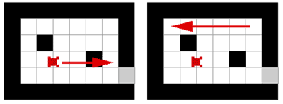
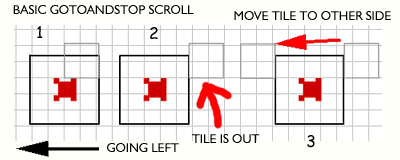
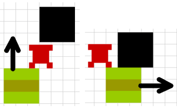

# SCROLLING

Before we start to scroll, we must make one thing very clear. Flash is slow. Flash is extremely slow. Scrolling means moving hundreds of tiles on screen and it should happen 20-30 times in second. Too many scrolling tiles means Flash cant draw them in time and slows down. Your game will crawl like a sleeping snail.

"What?" you might wonder, "no scrolling? And how did snail fall to sleep?".

You can make scrolling tiles, but you should be careful not to make scrolling area too big and not to scroll too many tiles. How big is too big and how many is too many, those answers you have to find out yourself. Remember, that Flash games are played mostly on the browser, probably many windows are opened same time, many programs are running on background and players doesnt always have latest power computers. Test your game in old crappy computers and if it feels slowing down, make it smaller.

Lets look what we will be making:


```
EXAMPLE HERE
```

## THEORY

In the left picture is non-scrolling game. Hero moves right, everything else stays where it was. Now, in the right picture we have scrolling game. Hero is also suppose to move right, but to make it look like scrolling, we actually keep hero in its current position and move everything else to the left.



So, theory is easy: when hero is suppose to move, move all the tiles in the opposite direction. But since we have used to place hero inside the tiles movie clip with all the background tiles, hero would move in opposite way with them. To fix it, we still move everything in opposite direction AND we will move hero same amount in correct direction.

Time for example. Scrolling game. Hero is suppose to move 10 pixels right. First, we move all the tiles (including hero) left by 10 px, and we move hero right by 10 px. In the end, it looks like hero has stayed on place, but other tiles have scrolled left.

Easiest way to scroll tiles, is to place all the tiles on screen, but to show only small portion of them, then we simply move them all around. This might make your game very slow, since thousands of tiles outside visible area still need resources. Next idea is to remove tiles when they go off from visible area and attach tiles when they come visible again. Thats better, but Flash spends too much time removing/attaching movie clips.

Our last hope is to place only visible tiles on stage and when they go off, we move the same tiles to the opposite side, rename them and reuse same movie clips. Thats called "gotoAndStop" scrolling engine:



Like seen on the picture, when tile goes off from right, we move the tile to the left. We also have to rename the movie clip, since all our movie clips have names like "t_3_4" which means it is placed in the y=3, x=4. And tile in the new position probably has to show different frame (graphic), that why we need to send it to correct frame with correct graphics and thats why this method is called "gotoAndStop".


## PREPARING TO SCROLL

In most scrolling games, hero is always staying on the center of screen.



You can see how number of tiles left from hero is equal to the number of tiles right from him. That means your number of columns is 3,5,7,9,11 etc, but never 2,4,6,8. Same goes for rows too.

Lets declare game object:

```
game = {tileW:30, tileH:30, currentMap:1, visx:7, visy:5, centerx:120, centery:90};
```

visx property is number of visible columns and visy is number of rows. We also need properties centerx/centery to mark center point of our movie.

When we scroll the tiles, we might have to show tiles that are not declared in the map array. Like when hero happily walks left until he stands on the leftmost tile declared with map array, we still have some tiles left from him to show. For those kind of tiles we create new tile type with no graphics to show (to make it easier for Flash). In the tiles movie clip make new empty keyframe in frame 20. Add the code to declare this type of tile:

```
game.Tile4 = function () {};
game.Tile4.prototype.walkable = false;
game.Tile4.prototype.frame = 20;
```

You might also want to cover some tiles partly ouside of visible area. For that purpose make new movie clip with linkage name "frame", that has hole in the middle, showing only the tiles through that hole.


## BUILD THE WORLD OF SCROLL

Lets start with buildMap function.

```
function buildMap (map)
{
	_root.attachMovie("empty", "tiles", 1);
	game.halfvisx = int(game.visx / 2);
	game.halfvisy = int(game.visy / 2);
```
We will calculate 2 new properties for the game object. halfvisx and halfvisx will hold information about number of columns and rows from the chars position to the edge of visible area. When total number of columns visx=5, then halfvisx=2, meaning 2 columns are right from hero, 2 columns are left and 1 is straight in the center with the hero.

```
game.clip = _root.tiles;
game.clip._x = game.centerx - (char.xtile * game.tileW) - game.tileW / 2;
game.clip._y = game.centery - (char.ytile * game.tileH) - game.tileH / 2;
```

We have to place movie clip holding all the tiles and the hero based on 2 variables: center point of the game declared in the game object by centerx/centery and position of the hero declared in the char object by xtile/ytile. When hero is placed on the x coordinate (char.xtile*game.tileW)+game.tileW/2, then tiles mc have to be in the opposite direction, thats why we subtract that number from the centerx.

```
for (var y = char.ytile - game.halfvisy; y <= char.ytile + game.halfvisy + 1; ++y)
{
	for (var x = char.xtile - game.halfvisx; x <= char.xtile + game.halfvisx + 1; ++x)
	{
		var name = "t_" + y + "_" + x;
		if (y >= 0 and x >= 0 and y <= map.length - 1 and x <= map[0].length - 1)
		{
			game[name] = new game["Tile" + map[y][x]]();
		}
		else
		{
			game[name] = new game.Tile4();
		}
		game.clip.attachMovie("tile", name, 1 + y * 100 + x * 2);
		game.clip[name]._x = (x * game.tileW);
		game.clip[name]._y = (y * game.tileH);
		game.clip[name].gotoAndStop(game[name].frame);
	}
}
```
This loop creates all the visible tile objects and also attaches movie clips for the tiles. As you can see, the loop doesnt start from 0 anymore, it starts from the ytile-halfvisy. Same way it doesnt run until the end of map array, it runs until ytile+halfvisy+1. The if condition then checks if the tile to be created is in the map array. If it falls outside the map, we use empty tile from the tile4 template.

In order to create seamless scroll, we have to use one extra row and one extra column of tiles in the right and bottom edge. Those tiles ensure, that even when we move half of tile to the other side, there wont be any empty space.

```
_root.attachMovie("frame", "frame", 100);
```

Last line attaches frame to cover areas of movie you dont want to be seen.

```
char.clip = game.clip.char;
char.x = (char.xtile * game.tileW) + game.tileW / 2;
char.y = (char.ytile * game.tileW) + game.tileW / 2;
char.width = char.clip._width / 2;
char.height = char.clip._height / 2;
char.clip._x = char.x;
char.clip._y = char.y;
char.clip.gotoAndStop(char.frame);
char.xstep = char.x;
char.ystep = char.y;
```

The char is created exactly same way as before. Only difference are 2 new properties xstep and ystep, which we will use later to check for right time to move rows or columns of tiles to the other side.


## SCROLL! SCROLL!

Now that we have set up the world, we need to actually scroll it. In the end of moveChar function after we have calculated the ob.xtile/ob.ytile for hero, add code to scroll:

```
game.clip._x = game.centerx - ob.x;
game.clip._y = game.centery - ob.y;
if (ob.xstep < ob.x - game.tileW)
{
	var xnew = ob.xtile + game.halfvisx + 1;
	var xold = ob.xtile - game.halfvisx - 1;
	for (var i = ob.ytile - game.halfvisy - 1; i <= ob.ytile + game.halfvisy + 1; ++i)
	{
		changeTile (xold, i, xnew, i, _root["myMap" + game.currentMap]);
	}
	ob.xstep = ob.xstep + game.tileW;
}
else if(ob.xstep > ob.x)
{
	var xold = ob.xtile + game.halfvisx + 1;
	var xnew = ob.xtile - game.halfvisx - 1;
	for (var i = ob.ytile - game.halfvisy - 1; i <= ob.ytile + game.halfvisy + 1; ++i)
	{
		changeTile (xold, i, xnew, i, _root["myMap" + game.currentMap]);
	}
	ob.xstep = ob.xstep - game.tileW;
}
if(ob.ystep < ob.y - game.tileH)
{
	var ynew = ob.ytile + game.halfvisy + 1;
	var yold = ob.ytile - game.halfvisy - 1;
	for (var i = ob.xtile - game.halfvisx - 1; i <= ob.xtile + game.halfvisx + 1; ++i)
	{
		changeTile (i, yold, i, ynew, _root["myMap" + game.currentMap]);
	}
	ob.ystep = ob.ystep + game.tileH;
}
else if(ob.ystep > ob.y)
{
	var yold = ob.ytile + game.halfvisy + 1;
	var ynew = ob.ytile - game.halfvisy - 1;
	for (var i = ob.xtile - game.halfvisx - 1; i <= ob.xtile + game.halfvisx + 1; ++i)
	{
		changeTile (i, yold, i, ynew, _root["myMap" + game.currentMap]);
	}
	ob.ystep = ob.ystep - game.tileH;
}
return (true);
```

First we move game.clip holding all the tiles and the hero to new position based on center point and coordinates of the hero. Then we have 4 similar blocks of code, each for 1 direction. When hero has moved more then the size of tiles, those loops call changeTile function with correct variables. When loop has ended and tiles have been moved/renamed/changed, we update ystep/xstep properties.

Now lets make that changeTile function:

```
function changeTile (xold, yold, xnew, ynew, map)
{
	var nameold = "t_" + yold + "_" + xold;
	var namenew = "t_" + ynew + "_" + xnew;
	if(ynew >= 0 and xnew >= 0 and ynew <= map.length - 1 and xnew <= map[0].length-1)
	{
		game[namenew] = new game["Tile" + map[ynew][xnew]]();
		game.clip[nameold]._name = namenew;
		game.clip[namenew].gotoAndStop(game[namenew].frame);
		game.clip[namenew]._x = (xnew * game.tileW);
		game.clip[namenew]._y = (ynew * game.tileH);
	}
	else
	{
		game[namenew] = new game.Tile3();
		game.clip[nameold]._name = namenew;
		game.clip[namenew].gotoAndStop(game[namenew].frame);
	}
}
```

So, we will receive 2 old coordinates and 2 new for our tile. To check if tile is still inside map array, we also have passed the map. "nameold" will be our tiles old name and "namenew" will be new name. After we have created new tile object with new and fresh name, the line:

```
game.clip[nameold]._name = namenew;
```

renames tiles movie clip. When new movie clip is empty, then we dont need to place it to the new _x/_y, it can remain in its old position.

You can download the source fla with all the code and movie set up here.