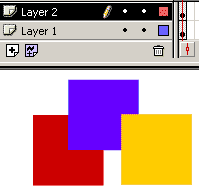
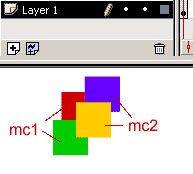
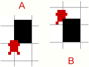
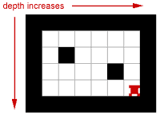
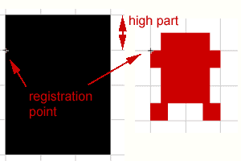

# DEPTH

So far we have kept our game stricktly two-dimensional. That means if some tile is in front of other tile, it will remain in front no matter what happens in the game. And for those poor unhappy tiles placed in the background will never make it to the front row. Luckily for the tiles on back and maybe not so luckily for the tiles currently in front, we can change the situation. To make our game look better, we will bring in the "depth", creating illusion of objects being closer or further. Here is an example (move the hero below and above same black wall tile):


```
EXAMPLE HERE
```

## MANY LEVELS OF FLASH

Im sure you have noticed how some things you draw in the Flash cover up other things. If objects are on the same layer, then things you have drawn later are placed in front. You can also change the order of objects on the same layer with "bring to front/send to back" commands from the Modify>>Arrange menu.

Flash has also been kind enough to provide us layers. Layers are great to arrange objects, when you draw something on the layer above other layer, it will always remain in front of objects on the other layer.



In the picture blue square and red square are both drawn on layer1. Blue square was drawn last, so its in front of red square. Yellow square is on layer2 and since layer2 is above layer1, yellow square covers both blue and red square.

In the next picture red and green squares are in the movie clip "mc1", blue and yellow squares are inside movie clip "mc2".



Blue and yellow square always cover red and green because the parent mc2 is above mc1. Inside movie clips you can arrange the order of squares, but you cant place blue square in front of red and same time yellow behind red.

So far everything we have looked at, are placed directly in Flash environment. As you know, the tile based games dont have tiles drawn directly on stage. Nonono, we cant do anything so simple! Instead, we are using "attachMovie" command to place movie clips on stage dynamically. attachmovie command has syntax

```
anyMovieClip.attachMovie(idName, newname, depth);
```

You see, it has depth written in its syntax already. What is exactly that "depth" in its syntax? Everything you draw directly in the stage, are placed on _level0. Thats the furthest it will go. Everything you attach dynamically (using attachmovie, duplicateMovieClip or loadMovie) will be placed in the higher levels, above _level0 . From now on we will only deal with movie clips attached to the stage. The other levels in Flash where only brought up to refresh your memory and make you more confused.


## FINDING RIGHT DEPTH

In picture A hero is covering part of wall, so hero looks like being closer to viewer then wall, but in the picture B part of the wall covers hero making hero standing further.



Now, whats the difference between those two pictures beside hero/wall coverup? The hero and wall are same. The wall is in the same spot. Yes, the hero has moved up. Now we will come to the very important conclusion: **object moves closer when its y-coordinate increases**. Its also worth to remember that we will consider higher depth being closer to viewer.

How could we change the depth of hero? Flash has a command for it: "swapDepths". We can change depth of any movie clip until we know what its depth should be. From the picture above we can say that in most basic level objects depth is its y coordinate:

```
mc.swapDepths(mc._y)
```

Since we have rows of tiles, all in exactly same y coordinate, we also should take into account the x coordinate, for no two movie clips cant share same depth in Flash. If you swapDepth movie clip to the depth, where another movie clip already sits in, they swap depths (hm, that's where the name of swapDepths comes from) and we dont want that.

```
mc.swapDepths(mc._y*movie_width+mc._x)
```



Tile in the left upper corner will be furthest, the depth of tiles increases (they will be closer) when moving right and down.


## Z-SORTING

z-sorting is fancier name for what we have done so far with depths. It comes from the 3D world, where every point has x, y and z coordinate. z coordinate determines how close or far the point is from viewer. We will make our tiles all have right depth and when the hero moves around, we will change its depth according to where he stands.

Please make sure that both tiles and hero have registration point in the left top corner. Draw the parts you want to overlap other tiles above registration point.



Now lets declare char object:

```
char={xtile:2, ytile:1, speed:4, width:20, height:20};
```

The width and height should be predetermine and not read using _height because we want the hero to walk partly over the walls.

Now to the buildmap function:

```
function buildMap (map)
{
	_root.attachMovie("empty", "tiles", 1);
	_root.tiles.attachMovie("empty", "back", 0);
	...
```

We will attach extra movie clip to the tiles mc. Thats where we will place all the ground tiles which cant overlap the hero. The tiles like walls and trees which can be also in front of hero, will be placed in the tiles mc directly. Since "back" movie clip is at level0 inside "tiles" mc, it will be always behind every other object, icluding hero and trees and walls. And everything inside "back" movie clip will also be behind all the other objects placed directly into "tiles" mc.

In the loop to create tiles use this code:

```
var name = "t_" + i + "_" + j;
game[name] = new game["Tile" + map[i][j]];
if(game[name].walkable)
{
	var clip = game.clip.back;
}
else
{
	var clip = game.clip;
}
game[name].depth = i * game.tileH * 300 + j * game.tileW + 1;
clip.attachMovie("tile", name, game[name].depth);
clip[name]._x = (j * game.tileW);
clip[name]._y = (i * game.tileH);
clip[name].gotoAndStop(game[name].frame);
```

After we have created tile object, we check if it is walkable tile (ground type) and if it is, we place it in the back movie clip. Next we calculate the depth of the tile. We will add 1 to the depth to avoid tile at x=0, y=0 being attached to the level0, where we have our "back" movie clip. If we would allow this, then "tile0_0" would replace "back" movie clip.

Now lets calculate the depth of hero too:

```
ob.depth = ob.y * 300 + ob.x + 1;
game.clip.attachMovie("char", "char", ob.depth);
```

And since the hero will change its depth in every step, add to the end of moveChar function:

```
ob.depth = ob.y * 300 + ob.x + 1;
ob.clip.swapDepths(ob.depth);
return (true);
```

Now each time moveChar function is run, the depth of object is updated. If you would happen to use other moving objects, they too would update their depth to correct value. But if you add more moving objects, you should make sure they cant have exactly same x/y coordinate.

You can download the source fla with all the code and movie set up here.