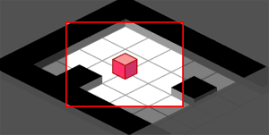
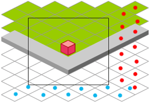
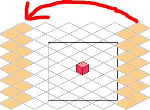

# ISOMETRIC SCROLL

Isometric scrolling is no different from the normal top-down view. With very little trouble we can easily combine scrolling engine (chapter 13) with isometric (chapter 16). This will result into isometric scrolling with diamond shaped view:

```
EXAMPLE HERE
```

We will count the movement of the char exactly like in the normal scroll and when tile has gone too far, we will move it to th other side. And after all the calculations are done and positions found, we convert it to the isometric view. I'm not going into exact code here, as the idea is explained before and you can look it up from the fla too.

You can download the source fla with all the code and movie set up here.

Diamond view has 1 big flaw: its shaped like diamond. Yes, diamonds are girls best friend and I have nothing against them personally, just your monitor is not shaped like diamond (or if it is, could you please send me picture of it). Your game will be shaped like rectangle too. Surely you can just create more tiles to cover the whole stage area, plus lot of tiles outside the stage.



It doesn't look bad in the picture, but it will get worse when you make your game bigger. More extra tiles will be around to eat away those precious CPU cycles. If your game is small enough and you don't want to bother too much with the more complex system, use simple isometric scroll. Rest of us, lets move on.


## SHAPE IT LIKE RECTANGLE

We can get rid of all the extra tiles with some more work. This movie doesn't create tiles in the same way as earlier examples, you can see the tiles being moved behind the gray frame:

```
EXAMPLE HERE
```

The code behind this movie is getting long and complicated so I try to explain the idea with less code samples. Please download the fla for the working actionscript.

The basic idea here is to fill the visible area with isometric tiles and not to have more tiles, that cant be viewed:



There is one extra row of tiles (marked with blue dots) and one column (red dots) to make sure tiles can be moved and they still fill the visible area. Now when our tiles have been moved right enough, we will take the whole column and move it straight across the stage (not in isometric angle!) to the left side. Same way with up/down movement.



To achieve this, we will set up bunch of new objects to hold information about the tiles. When building the map in the beginning the tile in the center (where hero stands) becomes "t_0_0" no matter on which tile the hero actually stands on.

```
if(y%2 != 0)
{
  var noisox = x * game.tileW * 2 + game.tileW + ob.xiso;
}
else
{
  var noisox = x * game.tileW * 2 + ob.xiso;
}
```

var noisoy = y * game.tileW / 2 + ob.yiso;
Because we want the isometric tiles to tile up nicely, we have to shift every other row to the right by half the actual tile width.

Next we will use the formulas from the iso mouse tutorial to find out which tile in isometric space should be shown it that position.

```
var ytile = ((2 * noisoy - noisox) / 2);
var xtile = (noisox + ytile);
ytile = Math.round(ytile / game.tileW);
xtile = Math.round(xtile / game.tileW);
```

We continue same way as in non scrolling isometric system, create new isometric object from the map data, find out its depth etc. But in addition we also create non_iso object, that remembers all the connections between isometric and normal objects and movie clips.

When moving the row or column of tiles over the stage with changeTile function, we use same method: move tile into new position, find out which tile should be shown there, create new objects and delete the old ones.

Now 2 warnings to look out for. First, since we have used another movie clip for the walkable tiles to avoid all the depth problems (game.clip.back), we might find that new position of the moved tile needs to be not walkable. Then we have to actually delete the old movie clip and attach new one in the game.clip. That is handled by saving the tiles _parent clip name with the no_iso object and comparing it later with new position for that tile movie clip.

Second problem is that Flash doesn't like movie clips in the negative depth ([read more here](https://www.kirupa.com/developer/actionscript/depths.htm)). Tiles can actually be placed in negative depths, but we won't be able to remove them later. Some of our tiles might end up in the depths like -3456. To avoid this problem I have added +100000 to each depth calculation (don't forget the hero too).

You can download the source fla with all the code and movie set up here.