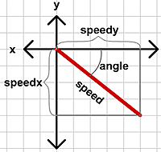
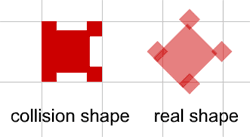

# ROTATE THE HERO

Hopefully you have noticed how our hero has been so far walking straight. He could walk straight to the left or straight to the right, but not in any angle. Now we will allow player to rotate the hero and walk in any direction. Play with this example, left and right arrow keys to rotate, up and down arrow keys to move:

```
EXAMPLE HERE
```

For this kind of game we only need 1 view on the hero as he is always looked directly down. So, you can get rid of all other frames in the char movie clip except the one, where hero faces right. Moving right is default position for movement, when angle of rotation is 0. Don't forget, the hero is still looked straight down, but he should be placed so he looks at the right.

For movement in any direction, we will need 2 variables, the angle of the movement and the value of the movement. We will use rotation of the hero movie clip for the angle and variable "speed" in the char object for the value of movement. When we know angle and value, we can find out x and y components from those:



To project speed vector with the known length and angle to the x and y axis, we can use these lines:

```
speedx = speed * Math.cos(angle);
speedy = speed * Math.sin(angle);
```

Don't forget the weird thing in Flash, that _rotation property is given in degrees and Math methods expect the angle to be in radians. If we use _rotation as angle, we must first convert it into radians using:

```
anglerad = _rotation * Math.PI / 180;
```

Ready to rewrite key detection function? What we want, is the char movie clip to rotate when left or right arrow keys are pressed and move when up or down arrow keys are pressed:

```
if (Key.isDown(Key.RIGHT))
{
  ob.clip._rotation += 5;
}
else if (Key.isDown(Key.LEFT))
{
  ob.clip._rotation -= 5;
}
if (Key.isDown(Key.UP))
{
  ob.speedx = ob.speed * Math.cos((ob.clip._rotation) * Math.PI / 180);
  ob.speedy = ob.speed * Math.sin((ob.clip._rotation) * Math.PI / 180);
  keyPressed = _root.moveChar(ob, ob.speedx, ob.speedy);
}
else if (Key.isDown(Key.DOWN))
{
  ob.speedx = -ob.speed * Math.cos((ob.clip._rotation) * Math.PI / 180);
  ob.speedy = -ob.speed * Math.sin((ob.clip._rotation) * Math.PI / 180);
  keyPressed = _root.moveChar(ob, ob.speedx, ob.speedy);
}
```

When up or down arrow keys are pressed, we first calculate the x and y movement values and then we call the moveChar function using those. Since we are now passing both values to the moveChar function, we also have to change some code in that function. So far our moveChar function has always got only 0, 1 or -1 in the x or y directions (refresh your memory from tutorial 4).

The number 5 here is only as an example, you can use other numbers to change the rotation. Try to use numbers that create full circle in the end (360 degrees). So 2, 4, 6, 12 and 90 are good, but 13.5 and 7 would be bad choice.

Remove all the ob.speed parts from that function:

```
function moveChar (ob, dirx, diry)
{
  getMyCorners(ob.x, ob.y + diry, ob);
  if (diry < -0.5)
  {
    if (ob.upleft and ob.upright)
    {
      ob.y += diry;
    }
    else
    {
      ob.y = ob.ytile * game.tileH + ob.height;
    }
  }
  if (diry > 0.5)
  {
    if (ob.downleft and ob.downright)
    {
      ob.y += diry;
    }
    else
    {
      ob.y = (ob.ytile + 1) * game.tileH - ob.height;
    }
  }
  getMyCorners(ob.x + dirx, ob.y, ob);
  if (dirx < -0.5)
  {
    if (ob.downleft and ob.upleft)
    {
      ob.x += dirx;
    }
    else
    {
      ob.x = ob.xtile * game.tileW + ob.width;
    }
  }
  if (dirx > 0.5)
  {
    if (ob.upright and ob.downright)
    {
      ob.x += dirx;
    }
    else
    {
      ob.x = (ob.xtile + 1) * game.tileW - ob.width;
    }
  }
  ob.clip._x = ob.x;
  ob.clip._y = ob.y;
  ob.xtile = Math.floor(ob.x / game.tileW);
  ob.ytile = Math.floor(ob.y / game.tileH);
  return (true);
}
```

I have added check for each movement value to be at least 0.5 pixels. When calculating speedx and speedy using sin and cos functions, Flash will return very small values instead of 0. Something like 0.00000000000000001255. You cant detect so small movement on the screen so we will ignore it.

As you can see, when the hero is rotated, it can move its corners by small amount into the wall tiles. This is happening because we are not taking into account its rotation when calculating the corner points. As long your hero is shaped like a square the corners won't go too much into walls, but when you use very tall rectangle for the hero the bug becomes obvious.



You can fix this easily by updating the width and height of the char object every time it is rotated. Place 2 lines in the left and right key detection code after changing the rotation:

```
char.width = char.clip._width / 2;
char.height = char.clip._height / 2;
```

This will take care of those pesky corners (yay!) but it will create another bug (bummer). You see, we only check for the corners when hero moves, but we don't check for corners when he rotates. This will allow the hero to rotate near the wall while standing so its corner goes into wall and when he starts to move finally, its position is updated and movement might look jumpy. I'm not sure which is better way so in the fla I have let the corners go into walls.

You can download the source fla with all the code and movie set up here.

In the next chapter we will have even more fun by rotating entire background.