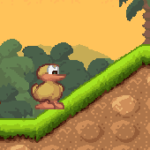
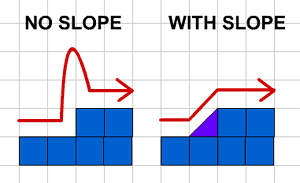
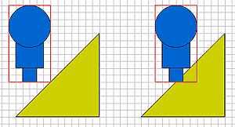
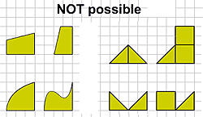
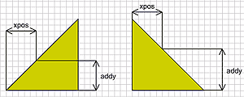

# SLOPES

This time we will see how to add slopes:

```
EXAMPLE HERE
```

Many people have asked me "How do I make my hero walk on the sloped tiles?". And I usually reply "Why on earth would you want your hero to walk on sloped tiles? Are you not happy with the rectangular tiles? Can't your hero just jump on the higher tiles?" And then they say "No, I must have sloped tiles".

Perhaps you do not know what sloped tiles are. In this picture, hero (the Duck named Charlie) is walking on sloped tile:



(Screenshot from the game "CHARLIE II"
by Mike Wiering / Wiering Software)

The slope allows our hero to get on higher (or lower) height simply by walking right (or left) without jumping (or falling). So, the slope we will talk about, is connecting 2 tiles with different heights:



When hero in left picture wants to continue moving right, he has to jump on the higher tile. But thanks to the slope, hero on the right picture is not forced into jumping. Sure, if our hero is jumper-type of hero, he could still jump in the right picture too, but normal heroes are very happy, if they can avoid jumping.


## PROBLEMS

As soon as we want to add sloped tiles, we will face several problems (I bet you didn't expect any problems). First, the placement of hero on the sloped tile. If you remember, our hero is basically rectangle, all the movement and collisions are based on his corner points. We cant use same idea on the slope, since most heroes would end up standing on the slope without their feet touching the ground. Instead, we have to place center of hero on the sloped ground and move part of hero inside the ground.



Next, the slopes in our game must always be from one corner of the tile to the opposite corner and you should be careful how you place the slopes. You can't make slopes with some other angle or shape and you cant make strange maps with slopes.




## CODE IT

Start with the code from tutorial 7 Jumping.

Declare new tile prototypes:

```
game.Tile4 = function() {};
game.Tile4.prototype.walkable = true;
game.Tile4.prototype.slope = 1;
game.Tile4.prototype.frame = 4;
game.Tile5 = function() {};
game.Tile5.prototype.walkable = true;
game.Tile5.prototype.slope = -1;
game.Tile5.prototype.frame = 5;
```

Tile4 has slope moving upward (/) and tile5 has slope moving down (\). Draw the slopes in frames you have set with frame property.

New functions are such nice things. They are fresh, smell good and do things you never new could be done. Lets make checkForSlopes function:

```
function checkForSlopes (ob, diry, dirx)
{
  if (game["t_" + (ob.ytile + 1) + "_" + ob.xtile].slope and !ob.jump)
  {
    ob.ytile += 1;
    ob.y += game.tileH;
  }
  if (game["t_" + ob.ytile + "_" + ob.xtile].slope and diry != -1)
  {
    if (diry == 1)
    {
      ob.y = (ob.ytile + 1) * game.tileH - ob.height;
    }
    var xpos = ob.x - ob.xtile * game.tileW;
    ob.onSlope = game["t_" + ob.ytile + "_" + ob.xtile].slope;
    ob.jump = false;
    if(game["t_" + ob.ytile + "_" + ob.xtile].slope == 1)
    {
      ob.addy = xpos;
      ob.clip._y = (ob.ytile + 1) * game.tileH - ob.height - ob.addy;
    }
    else
    {
      ob.addy = game.tileW - xpos;
      ob.clip._y = (ob.ytile + 1) * game.tileH - ob.height - ob.addy;
    }
  }
  else
  {
    if((ob.onSlope == 1 and dirx == 1) or (ob.onSlope == -1 and dirx == -1))
    {
      ob.ytile -= 1;
      ob.y -= game.tileH;
      ob.clip._y = ob.y;
    }
    ob.onSlope = false;
  }
}
```

This function will be called from moveChar function with movement variables dirx and diry. First if statement checks for the slope on the tile below current tile. This is for the situation, where hero currently stands on unwalkable tile, but moves left or right and there is slope going down from his current height. If there is slope below hero, we increase the ytile and y. However, we will not check for it, if hero is jumping.

Next if statement checks for the slope on the tile hero currently is. The diry != -1 part ignores the check, if SPACE key has been pressed and hero jumps up.

If we were falling down (diry == 1), we will set the y property as if hero would of landed on tile below. We set jump property to false and onSlope property equal to the slope value on current tile (1 or -1).

xpos is the value of how far from the left edge of current tile center of our hero is:



If slope is going up, then we move hero up by the value of xpos, if its going down, then by the value of tileW-xpos. Note that if you don't use square tile, then you would need to find xpos as percentage from tileW.

Last part after else statement checks if we were standing on slope, but now we have moved off from it onto higher tile.

Next take moveChar function. Modify the check for going left and right:

```
//left
if ((ob.downleft and ob.upleft) or ob.onSlope)
{
  ...
 
//right
if ((ob.upright and ob.downright) or ob.onSlope)
{
  ...
```
 
Here we will basically ignore all collision checks for left/right movement as long hero is on the slope. Remember, while on slope, he is standing partially inside the wall, so we can't use normal collision with his corners.

After placing the hero movie clip, call checkForSlopes function:

```
ob.clip._x = ob.x;
ob.clip._y = ob.y;
checkForSlopes(ob, diry, dirx);
```

When we jump while standing on the slope, we have to update the y coordinate of the hero. Modify detectKeys function:

```
if (Key.isDown(Key.SPACE))
{
  if (!ob.jump)
  {
    //if we were on slope, update
    if (ob.onSlope)
    {
      ob.y -= ob.addy;
      ob.ytile = Math.floor(ob.y / game.tileH);
    }
    ob.jump = true;
    ob.jumpspeed = ob.jumpstart;
  }
}
else if (Key.isDown(Key.RIGHT))
{
  keyPressed = _root.moveChar(ob, 1, 0);
}
else if (Key.isDown(Key.LEFT))
{
  keyPressed = _root.moveChar(ob, -1, 0);
}
```

If hero has onSlope property set to true, we will first update its y property and calculate new value for the ytile.

You can download the source fla with all the code and movie set up here.